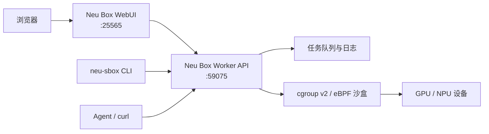

<p align="center">
  
</p>

<h1 align="center">Neu Box</h1>

<p align="center">
  面向 Linux 异构计算节点的轻量级设备资源仲裁、沙盒隔离与任务执行系统
</p>

<p align="center">
  
  
  
  <a href="https://github.com/neusbox/neu_box/releases"></a>
</p>

Neu Box 为 GPU、NPU 等异构设备节点提供统一的资源入口。它将设备分配、
cgroup v2 进程隔离、eBPF 访问控制、异步任务队列和发布运维组合为一个节点侧
Worker，同时提供 WebUI、命令行客户端和面向 Agent 的标准 HTTP 使用方式。

本仓库是 Neu Box 的核心 Worker，也是三个独立仓库的聚合与兼容性验证仓库。

## 核心能力

| 能力 | 说明 |
|---|---|
| 终端沙盒 | 把宿主机终端进程迁入 cgroup 独占设备；容器不搬迁，按 mount namespace 登记归属、借用所在沙盒的授权 |
| 命令任务 | 异步提交、优先级排队、自动分配资源、隔离执行并持久化任务日志 |
| 设备仲裁 | 综合 Neu Box 分配记录与驱动侧外部占用信息，避免把忙碌设备重复分配 |
| 内核访问控制 | 通过 cgroup v2 与 eBPF 限制未获授权进程后续打开已预留设备 |
| RPM 生命周期 | 使用架构相关 RPM 管理程序文件，以显式数据库迁移和健康检查完成部署 |
| Agent 接入 | Worker API v2 可直接通过 `curl` 使用；`neu-sbox` 提供可选的确定性 helper 与内置 skill |

## 系统架构



Neu Box 由三个独立维护、独立发版的仓库组成。它们不共享运行时代码，仅通过
HTTP 契约协作：

| 仓库 | 职责 | 部署方式 |
|---|---|---|
| **[neu_box](https://github.com/neusbox/neu_box)** | Worker、设备沙盒、任务执行、RPM 与聚合测试 | 架构相关 RPM |
| **[neu_box_webui](https://github.com/neusbox/neu_box_webui)** | 节点池、任务转发、实验记录与 Web 界面 | Python 3.11+ 源码运行 |
| **[neu_box_goClient](https://github.com/neusbox/neu_box_goClient)** | `neu-sbox` CLI 与 Agent skill | Go 静态二进制 |

本仓库通过 `thirds/webui` 和 `thirds/goClient` submodule 固定已验证的配套提交，
作为跨仓库兼容矩阵。

## 快速开始

### 环境要求

- Linux `x86_64` 或 `aarch64`，内核 5.11+，使用 systemd 与 cgroup v2
- 内核提供 `/sys/kernel/btf/vmlinux`（通常需要启用 `CONFIG_DEBUG_INFO_BTF=y`），供
  BPF CO-RE 读取当前任务和 mount namespace
- root 或可用的 `sudo`（安装、设备隔离与服务管理需要）
- `/bin/bash`（安装后的管理 CLI 使用；native sandbox 直接调用 libbpf）
- 对应厂商的设备驱动和状态工具，例如 `nvidia-smi` 或 `npu-smi`
- Docker 仅在需要容器执行目标时需要

### 安装 Worker

从 [GitHub Releases](https://github.com/neusbox/neu_box/releases) 下载与目标机器
架构匹配的 `neuboxd` RPM：

```bash
sudo dnf install ./neuboxd-<version>-<release>.<arch>.rpm
sudoedit /etc/neu-box/worker.env
sudo neuboxctl setup
curl -fsS http://127.0.0.1:59075/healthz
sudo neuboxctl test            # 维护窗口内：真实任务与设备的实机验收
```

`neuboxctl setup` 迁移并检查数据库，以暂停状态启动 Worker；Worker 加载
BPF，通过健康检查后恢复调度。默认等待启动 60 秒，可用 `--timeout` 调整。
Worker 默认监听 `0.0.0.0:59075`，安装后的运维入口是
`/usr/sbin/neuboxctl`。

`setup` 通过后跑 `neuboxctl test` 做验收：套件随 RPM 安装在
`/usr/libexec/neu-box/tests/`，是一个自带 pytest 的 PyInstaller 产物（部署机不需要
Python），打真实 HTTP API、真实任务、真实设备、真实容器，最后几条用例还会按维护
流程停/起 Worker（给 MainPID 发 SIGTERM、再用 `setup` 拉起）。
它**不跳过**：缺任何前置（Worker 不通、没有空闲卡、卡数不够、dockerd 不在、
`default-runtime` 没配成 `neu-box-runtime`）都会失败并说明缺什么。要在维护窗口、
以 root 运行，参数见 `neuboxctl test --help`。详见
[部署与升级手册](docs/deployment.md#api-与实机验收)。

### 日常管理

服务与日志用 systemd 工具做**只读观察**（`status` / `is-active` / `journalctl`）；
服务的停/起属于维护动作，由运维入口负责：

```bash
neuboxd --version               # 查看 Worker 版本
sudo systemctl status neuboxd.service          # 查看服务状态
sudo journalctl -u neuboxd.service -n 100 -f   # 跟踪 Worker 日志
sudo neuboxctl pause           # 唯一的停服路径：排空 → 备份 → cleanup → 停服
sudo neuboxctl setup           # 唯一的启动路径：迁移 → 拉起 → 健康检查 → 恢复调度
sudo neuboxctl db status       # 查看数据库 schema 状态
sudo neuboxctl db backup       # 创建一致的 SQLite 备份
```

`RefuseManualStop=yes` 是刻意的：`systemctl stop` 和 `systemctl restart` 会被
systemd 拒绝，因为直接停服务会跳过排空、备份和旧 BPF 清理。

普通 RPM 升级分三步，前一步成功后再执行下一步：

```bash
sudo neuboxctl pause
sudo dnf install ./neuboxd-<version>-<release>.<arch>.rpm
sudo neuboxctl setup
```

旧版 `pause` 暂停接收新任务及分配沙盒，等待运行任务和沙盒结束，再备份数据库与配置、
清理旧 BPF，全部成功后才停服；pending 任务保留，等待新版 `setup` 完成后继续执行。
`pause` 默认一直等待，`--timeout <秒>` 可限制等待时间；等待超时、备份或清理失败会报错，
Worker 保持在线且暂停，不会自动杀任务或继续升级。

完整的安装、升级、目录权限和 Release 资产规范见
[部署与升级手册](docs/deployment.md)；native helper、BPF maps 和设备预留语义见
[沙盒说明](docs/sandbox.md)。

## 使用 `neu-sbox`

`neu-sbox` 直连 Worker，不经过 WebUI：

```bash
# 检查 Worker 和 API 兼容性
neu-sbox check

# 当前终端独占两张设备卡
neu-sbox acquire --device-num 2
neu-sbox release <sandbox_name>

# 提交四卡任务并增量跟踪日志
neu-sbox submit --device-num 4 --priority 1 -- python train.py
neu-sbox wait <task_id>

# 将内置 Agent skill 安装到指定技能根目录
neu-sbox skill install ~/.codex/skills
```

安装与完整参数说明见
[neu_box_goClient](https://github.com/neusbox/neu_box_goClient)。

## HTTP API

Worker API v2 的基础地址默认为 `http://<worker-host>:59075`：

```bash
curl http://127.0.0.1:59075/healthz
curl http://127.0.0.1:59075/status
```

主要资源：

| 接口 | 用途 |
|---|---|
| `POST /tasks` | 提交异步任务 |
| `GET /tasks/<task_id>` | 查询任务状态与结果 |
| `GET /tasks/<task_id>/log` | 分段或完整读取任务日志 |
| `DELETE /tasks` | 删除或取消任务 |
| `GET /maintenance` | 查询暂停状态以及是否已可维护 |
| `POST /sandbox/acquire` | 为 Worker 宿主机 PID 分配终端沙盒 |
| `POST /sandbox/release` | 释放终端沙盒与设备 |
| `GET /sandbox/list` | 查询沙盒、设备与 PID 快照 |

请求格式、状态码、日志轮询方式和容器身份模型见
[Worker HTTP API](docs/worker-api.md)。

## 兼容性

| 组件 | 当前系列 | 兼容要求 |
|---|---|---|
| Worker | `0.5.x` | `api_version = 2` |
| WebUI | `0.1.x` | Worker `>= 0.4.0` |
| `neu-sbox` | `0.2.x` | Worker `>= 0.4.0` |

`API_VERSION` 只在发生破坏性 HTTP 契约变更时递增。部署前可使用
`neu-sbox check` 或 `/healthz` 验证兼容性。

## 隔离边界

- eBPF 策略限制的是设备文件的后续打开，不会主动终止在设备预留前已经持有访问的进程。
- Worker 在每次分配前检测沙盒外设备占用；共享节点仍建议所有使用方统一通过 Neu Box 申请设备。
- Reaper 以内核 cgroup 的递归进程状态为准；只有沙盒内最后一个进程退出后才释放设备。
- Neu Box 提供节点内资源仲裁与隔离，不替代集群级身份认证、网络边界或厂商驱动安全机制。

## 开发与测试

```bash
git clone --recurse-submodules https://github.com/neusbox/neu_box.git
cd neu_box

uv sync --frozen --all-groups

# 构建当前架构 RPM（输出到 dist/rpm）
uv run --frozen --group build deploy/build_release.py
```

构建原生沙盒还需要 GNU Make、C++17 编译器、支持 BPF target 的
Clang、`pkg-config`、libbpf 1.0+ 开发包，以及提供 `readelf` 的
binutils，详见
[部署与升级手册](docs/deployment.md#构建-rpm)。

实机验收套件在 `tests/deployment/`：pytest 写的，按 manifest 分成七个组各一个文件
（基本盘 / 单卡 / 多卡 / 调度 / 容器 / 收尸 / 停机维护），执行顺序就按这个顺序
—— 不碰卡的在前，会停/起 Worker 的维护组独占最后。每组一个 session fixture 查
该组前置，缺什么就 fail 并写清缺的是什么（**不跳过**）。它被打成 PyInstaller onedir 产物随 RPM
安装到 `/usr/libexec/neu-box/tests/`，对已部署的 Worker 用
`neuboxctl test` 运行。它会创建真实任务、占用设备、起真实容器，还会重启
Worker，应在维护窗口以 root 执行。

开发机上这套用例默认**不参与** `pytest tests/`（它需要一台部署好的机器）；要跑
就显式走入口：

```bash
uv run --frozen python tests/deployment/run.py --url http://127.0.0.1:59075
```

## 仓库结构

```text
src/neu_box/          Worker 应用、任务执行、沙盒与设备管理
native/sandbox/       C++17 沙盒 CLI、libbpf 用户态实现与 BPF 源码
deploy/               RPM 构建、配置和 systemd unit
docs/                 API、部署、配置、测试与数据库迁移文档
thirds/               WebUI 与 Go Client 的兼容性 submodule
```

## 文档

| 文档 | 内容 |
|---|---|
| [部署与升级手册](docs/deployment.md) | RPM 安装、升级、权限与日志 |
| [Worker 配置](docs/configuration.md) | `worker.env` 变量、旧键迁移与生效方式 |
| [Worker 测试](docs/testing.md) | 单元、集成、native 与发布前测试 |
| [Worker HTTP API](docs/worker-api.md) | API v2 契约、任务、日志和终端沙盒 |
| [容器归属登记](docs/container-registration.md) | `/container/register` 的 Worker 侧流程、锁序与失败语义（runtime 侧见 neu_box_runtime） |
| [设备隔离原理](docs/isolation.md) | 预留表 / mnt ns 委托 / 驱动 UDA 表三层怎么合起来保证隔离，以及 release、exec、stop→start 各条路径的结论 |
| [数据库迁移手册](docs/database-migrations.md) | Schema 版本、迁移开发与部署检查 |

## 版本与发布

- Worker 版本定义在 `src/neu_box/__init__.py`
- 构建入口为 `deploy/build_release.py`，产物写入 `dist/rpm/`
- GitHub Release 使用 `v<version>` tag，并为 x86_64、aarch64 分别发布对应 RPM
- RPM 的 Version 取自 `src/neu_box/__init__.py`；修订构建应递增 Release

## 参与项目

问题与功能建议请提交到 [GitHub Issues](https://github.com/neusbox/neu_box/issues)。
提交代码前请同步更新相关 API 或部署文档。

## License

许可条款见 [LICENSE](LICENSE)。
