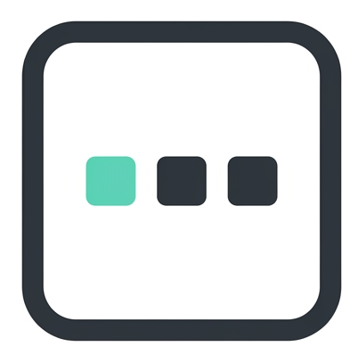
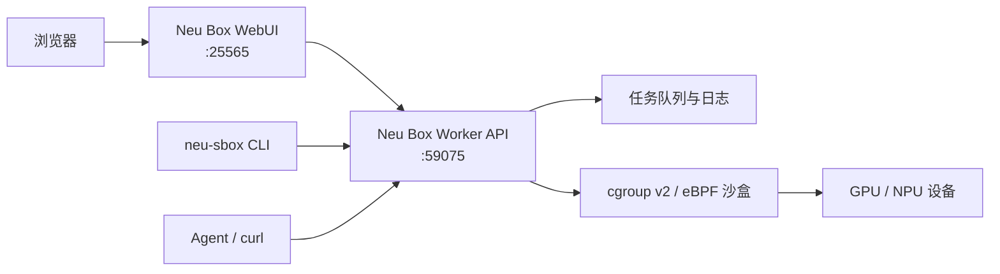

<p align="center">
  
</p>

<h1 align="center">Neu Box</h1>

<p align="center">
  面向 Linux 异构计算节点的轻量级设备资源仲裁、沙盒隔离与任务执行系统
</p>

<p align="center">
  
  
  
  <a href="https://github.com/neusbox/neu_box/releases"></a>
</p>

Neu Box 为 GPU、NPU 等异构设备节点提供统一的资源入口。它将设备分配、
cgroup v2 进程隔离、eBPF 访问控制、异步任务队列和发布运维组合为一个节点侧
Worker，同时提供 WebUI、命令行客户端和面向 Agent 的标准 HTTP 使用方式。

本仓库是 Neu Box 的核心 Worker，也是三个独立仓库的聚合与兼容性验证仓库。

## 核心能力

| 能力 | 说明 |
|---|---|
| 终端沙盒 | 将宿主机或现有 Docker 容器中的终端进程迁入 cgroup，独占指定设备 |
| 命令任务 | 异步提交、优先级排队、自动分配资源、隔离执行并持久化任务日志 |
| 设备仲裁 | 综合 Neu Box 分配记录与驱动侧外部占用信息，避免把忙碌设备重复分配 |
| 内核访问控制 | 通过 cgroup v2 与 eBPF 限制未获授权进程后续打开已预留设备 |
| 生命周期管理 | 支持版本化安装、在线/离线升级、数据库迁移、健康检查和失败回滚 |
| Agent 接入 | Worker API v2 可直接通过 `curl` 使用；`neu-sbox` 提供可选的确定性 helper 与内置 skill |

## 系统架构



Neu Box 由三个独立维护、独立发版的仓库组成。它们不共享运行时代码，仅通过
HTTP 契约协作：

| 仓库 | 职责 | 部署方式 |
|---|---|---|
| **[neu_box](https://github.com/neusbox/neu_box)** | Worker、设备沙盒、任务执行、安装器与聚合测试 | 版本化 Linux 发布包 |
| **[neu_box_webui](https://github.com/neusbox/neu_box_webui)** | 节点池、任务转发、实验记录与 Web 界面 | Python 3.11+ 源码运行 |
| **[neu_box_goClient](https://github.com/neusbox/neu_box_goClient)** | `neu-sbox` CLI 与 Agent skill | Go 静态二进制 |

本仓库通过 `thirds/webui` 和 `thirds/goClient` submodule 固定已验证的配套提交，
作为跨仓库兼容矩阵。

## 快速开始

### 环境要求

- Linux `amd64` 或 `arm64`，使用 systemd 与 cgroup v2
- root 或可用的 `sudo`（安装、设备隔离与服务管理需要）
- `bash`、`bpftool`、`busctl`
- 对应厂商的设备驱动和状态工具，例如 `nvidia-smi` 或 `npu-smi`
- Docker 仅在使用现有容器执行目标时需要

### 安装 Worker

从 [GitHub Releases](https://github.com/neusbox/neu_box/releases) 下载与目标机器
架构匹配的发布包及其 `.sha256` 文件：

```bash
VERSION=0.4.0
ARCH=arm64  # 或 amd64
PACKAGE="neu-box-${VERSION}-linux-${ARCH}.tar.gz"

curl -fLO "https://github.com/neusbox/neu_box/releases/download/v${VERSION}/${PACKAGE}"
curl -fLO "https://github.com/neusbox/neu_box/releases/download/v${VERSION}/${PACKAGE}.sha256"
sha256sum -c "${PACKAGE}.sha256"

tar -xzf "$PACKAGE"
cd "${PACKAGE%.tar.gz}"
sudo ./neu-box-install install --role worker
```

安装完成后，Worker 默认监听 `0.0.0.0:59075`，管理入口安装为
`/usr/local/sbin/neu-box`。

### 日常管理

```bash
neu-box                 # 打开交互式管理菜单
neu-box status          # 查看安装版本与回滚状态
neu-box service-status  # 查看 systemd 服务状态
neu-box logs            # 跟踪 Worker 日志
neu-box check-update    # 检查 GitHub latest Release
neu-box update          # 在线下载、校验、解压并升级
neu-box rollback        # 回滚程序和升级前数据库
```

在线更新会自动选择本机架构，执行外层 SHA256 与包内文件校验，并复用安装器已有的
数据库备份、迁移预检、健康检查和失败恢复。无法访问 GitHub 时，仍可使用：

```bash
neu-box upgrade /path/to/extracted-release
neu-box upgrade /path/to/neu-box-<version>-linux-<arch>.tar.gz
```

本地 `.tar.gz` 发布包会解压到临时目录，升级结束后自动清理，不需要手工解包。

完整的安装、升级、回滚、目录权限和 Release 资产规范见
[部署与升级手册](docs/deployment.md)。

## 使用 `neu-sbox`

`neu-sbox` 直连 Worker，不经过 WebUI：

```bash
# 检查 Worker 和 API 兼容性
neu-sbox check

# 当前终端独占两张设备卡
neu-sbox acquire --device-num 2
neu-sbox release <sandbox_name>

# 提交四卡任务并增量跟踪日志
neu-sbox submit --device-num 4 --priority 1 -- python train.py
neu-sbox wait <task_id>

# 将内置 Agent skill 安装到指定技能根目录
neu-sbox skill install ~/.codex/skills
```

安装与完整参数说明见
[neu_box_goClient](https://github.com/neusbox/neu_box_goClient)。

## HTTP API

Worker API v2 的基础地址默认为 `http://<worker-host>:59075`：

```bash
curl http://127.0.0.1:59075/healthz
curl http://127.0.0.1:59075/status
```

主要资源：

| 接口 | 用途 |
|---|---|
| `POST /tasks` | 提交异步任务 |
| `GET /tasks/<task_id>` | 查询任务状态与结果 |
| `GET /tasks/<task_id>/log` | 分段或完整读取任务日志 |
| `DELETE /tasks` | 删除或取消任务 |
| `POST /sandbox/acquire` | 为 Worker 宿主机 PID 分配终端沙盒 |
| `POST /sandbox/release` | 释放终端沙盒与设备 |
| `GET /sandbox/list` | 查询沙盒、设备与 PID 快照 |

请求格式、状态码、日志轮询方式和容器身份模型见
[Worker HTTP API](docs/worker-api.md)。

## 兼容性

| 组件 | 当前系列 | 兼容要求 |
|---|---|---|
| Worker | `0.4.x` | `api_version = 2` |
| WebUI | `0.1.x` | Worker `>= 0.4.0` |
| `neu-sbox` | `0.2.x` | Worker `>= 0.4.0` |

`API_VERSION` 只在发生破坏性 HTTP 契约变更时递增。部署前可使用
`neu-sbox check` 或 `/healthz` 验证兼容性。

## 隔离边界

- eBPF 策略限制的是设备文件的后续打开，不会主动终止在设备预留前已经持有访问的进程。
- Worker 在每次分配前检测沙盒外设备占用；共享节点仍建议所有使用方统一通过 Neu Box 申请设备。
- Reaper 以内核 cgroup 的递归进程状态为准；只有沙盒内最后一个进程退出后才释放设备。
- Neu Box 提供节点内资源仲裁与隔离，不替代集群级身份认证、网络边界或厂商驱动安全机制。

## 开发与测试

```bash
git clone --recurse-submodules https://github.com/neusbox/neu_box.git
cd neu_box

uv sync --frozen --all-groups
uv run --frozen pytest -q tests/unit

# 构建当前架构发布包
uv run --frozen --group build deploy/build_release.py

# 对已部署 Worker 执行真实 API、任务、设备和 Reaper 验收
./run.sh deployment-test
```

单元测试默认不访问生产服务；实机验收会创建真实任务并短暂占用最多两张设备，应在维护
窗口执行。测试范围与参数见 [tests/README.md](tests/README.md)。

## 仓库结构

```text
src/neu_box/worker/   Worker 应用、任务执行、沙盒与设备管理
deploy/               发布构建、安装器、配置和 systemd unit
docs/                 API、部署与数据库迁移文档
tests/                单元测试、跨仓库集成测试与实机验收
thirds/               WebUI 与 Go Client 的兼容性 submodule
run.sh                安装、升级、运维、测试和构建统一入口
```

## 文档

| 文档 | 内容 |
|---|---|
| [部署与升级手册](docs/deployment.md) | 安装、在线/离线升级、回滚、配置、权限与日志 |
| [Worker HTTP API](docs/worker-api.md) | API v2 契约、任务、日志和终端沙盒 |
| [数据库迁移手册](docs/database-migrations.md) | Schema 版本、迁移开发、部署与回滚 |
| [测试说明](tests/README.md) | 单元测试、集成测试与实机验收 |

## 版本与发布

- Worker 版本定义在 `src/neu_box/__init__.py`
- 同一版本号不得以不同内容重新构建；安装器会按 `SHA256SUMS` 拒绝原地覆盖
- GitHub Release 使用 `v<version>` tag，并为每种架构同时上传 `.tar.gz` 与
  `.tar.gz.sha256`

## 参与项目

问题与功能建议请提交到 [GitHub Issues](https://github.com/neusbox/neu_box/issues)。
提交代码前请运行单元测试，并同步更新相关 API 或部署文档。

## License

许可条款见 [LICENSE](LICENSE)。
